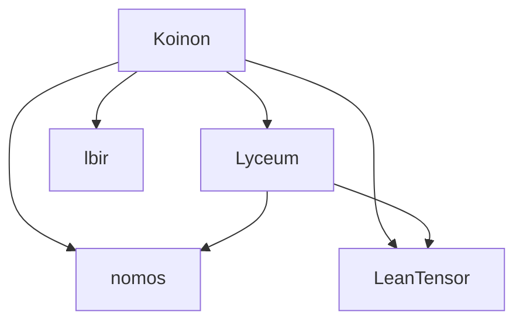

# Koinon (コイノン) - Standalone LLM Omni-Server プロジェクト概要

## 1. プロジェクト目的
**Koinon** は、Lean 4 形式検証カーネル（`nomos`）、マルチモダリティ基盤（`Lyceum`）、および AVX-512 ネイティブテンソル演算ライブラリ（`LeanTensor`）をベースに構築された**スタンドアロンの LLM マイクロサービス / Omni-Server** です。

単一のサーバープロセスでありながら、既存エコシステム（OpenAI REST API）との完全な上位互換性、Agent プロトコル（MCP: Model Context Protocol）とのネイティブ連携、およびローカル LLM (Gemma GGUF) / リモート LLM (Gemini 2.0) のハイブリッド自動ルーティングを提供します。

---

## 2. コアアーキテクチャ ＆ 機能特性

### ① OpenAI 互換 REST API インターフェース (`Koinon.Protocol.OpenAI`)
- **提供エンドポイント**:
  - `GET /v1/models` : 利用可能なモデル一覧の返却。
  - `POST /v1/chat/completions` : 対話生成リクエスト（Structured Output / Streaming サポート）。
  - `POST /v1/embeddings` : テキスト埋め込みベクトルの生成。
- **互換性**: LangChain, Cursor, Aider, Open WebUI 等の既存クライアントから無改造で接続可能。

### ② ハイブリッド LLM ルーティングエンジン (`Koinon.Engine.HybridRouter`)
- **動的バックエンド選択**:
  - **Local Mode**: オフライン・機密データ処理時、`LeanTensor` による C/C++ FFI ネイティブ Gemma GGUF 推論を実行。
  - **Remote Mode**: 大規模コンテキスト・画像/動画解析時、Gemini 2.0 リモート API (`gemini-2.0-flash-exp`) へ高速透過ルーティング。
  - **Auto Hybrid Mode**: トークン長・モダリティに応じて最適な推論先を自律判定。

### ③ MCP (Model Context Protocol) 統合 (`Lyceum.JsonRpc` / `Koinon.Server.Router`)
- JSON-RPC over Stdio/SSE 通信をサポートし、`Pakila` や Antigravity などの AI エージェントに対して推論・埋め込み・RAG 検索ツールを透過提供。

### ④ インメモリ VectorDB RAG 検索 (`Lyceum.Memory.VectorDB`)
- 高次元埋め込みベクトルのインメモリセマンティック検索機能を内包。

---

## 3. ディレクトリ・モジュール構造

```
koinon/
├── Koinon.lean               # Koinon 全体モジュール定義
├── Koinon/
│   ├── Protocol/
│   │   └── OpenAI.lean       # OpenAI REST API DTO 構造体 (ChatCompletion, ModelList)
│   ├── Engine/
│   │   └── HybridRouter.lean # Gemma GGUF vs Gemini Remote API ルーティング
│   └── Server/
│       └── Router.lean       # REST API & MCP リクエストディスパッチャー
├── Main.lean                 # サーバーエントリーポイント
├── test/
│   └── ServerTest.lean       # ルーティング ＆ OpenAI DTO 検証テスト (100% PASS)
├── doc/
│   └── CURRENT_STATUS.md     # 開発ステータスドキュメント
├── DESIGN_SPEC.vlog          # HV-CAD ガバナンス仕様ログ
├── lakefile.lean             # Lean 4 ビルドマニフェスト
├── lean-toolchain            # ツールチェーンバージョン (v4.31.0)
└── PROJECT_OVERVIEW.md       # 本ドキュメント
```

---

## 4. 依存パッケージ関係



---

## 5. ビルド ＆ 形式検証テスト手順

```bash
# プロジェクトのビルド
lake build

# サーバー検証テストの実行
lake exe server_test
```
