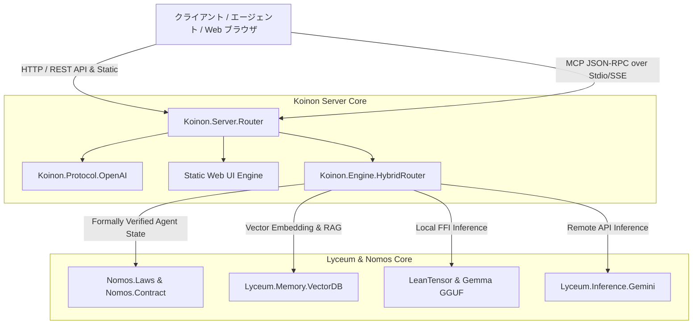

# Koinon システムアーキテクチャ設計書

## 1. 概要
**Koinon (コイノン)** は、Lean 4 の型安全・形式検証カーネル（`nomos`）、マルチモダリティプロトコル（`Lyceum`）、および AVX-512 高速テンソル推論ライブラリ（`LeanTensor`）の上に構築された**スタンドアロン LLM Omni-Server** である。

本設計書は、Koinon の全体アーキテクチャ、レイヤー構造、モジュール間相互作用、およびハイブリッドルーティング機構の物理的・理論的設計を定義する。

---

## 2. システム全体構成 (System Topology)

Koinon は以下の 4 つのメインレイヤーで構成される：



---

## 3. レイヤー・モジュール詳細設計

### 3.1. ネットワーク ＆ ルーティング層 (`Koinon.Server.Router`)
- **責務**:
  - HTTP ソケットリクエストの読み込みとメソッド / パス判定。
  - REST API リクエスト、MCP JSON-RPC メッセージ、および Web UI 静的ファイルの決定論的分岐。
- **ルーティングマトリックス**:

| メソッド | パス | 処理モジュール | 応答フォーマット |
| :--- | :--- | :--- | :--- |
| `GET` | `/` または `/index.html` | 静的ファイルサーブ (`web/index.html`) | `text/html` |
| `GET` | `/style.css` | 静的ファイルサーブ (`web/style.css`) | `text/css` |
| `GET` | `/app.js` | 静的ファイルサーブ (`web/app.js`) | `application/javascript` |
| `GET` | `/v1/models` | `ModelListResponse` 生成 | `application/json` |
| `POST` | `/v1/chat/completions` | `ChatCompletionRequest` パース ＆ 推論実行 | `application/json` |
| `POST` | `/v1/embeddings` | `NativeEmbedding` ベクトル生成 | `application/json` |

---

### 3.2. プロトコル変換層 (`Koinon.Protocol.OpenAI`)
- **責務**:
  - OpenAI 互換 DTO 構造体 (`ChatCompletionRequest`, `ChatCompletionResponse`, `ModelListResponse`) と `Lyceum.Message` / `MessagePart` 相互変換。
- **データ構造**:
  ```lean
  structure ChatMessage where
    role : String
    content : String

  structure ChatCompletionRequest where
    model : String
    messages : List ChatMessage
    temperature : Option Float := none
    max_tokens : Option Nat := none

  structure ChatCompletionResponse where
    id : String
    object : String := "chat.completion"
    created : Nat
    model : String
    choices : List ChatChoice
    usage : UsageInfo := {}
  ```

---

### 3.3. ハイブリッド推論エンジン層 (`Koinon.Engine.HybridRouter`)
- **動的ルーティングアルゴリズム**:
  ```
  [入力リクエスト]
        │
        ├─► Mode == .localGguf ─────► LeanTensor / Gemma GGUF Native FFI
        ├─► Mode == .remoteGemini ──► Lyceum.Inference.Gemini (Gemini 2.0 API)
        └─► Mode == .hybridAuto ───► トークン長 & モダリティ判定
                                        ├─► [Tokens <= 4096] Local Gemma GGUF
                                        └─► [Tokens > 4096 / Video] Remote Gemini 2.0
  ```

---

### 3.4. RAG ＆ インメモリ VectorDB 層 (`Lyceum.Memory.VectorDB`)
- **責務**:
  - テキストのベクトル埋め込み変換 (`NativeEmbedding`) とコサイン類似度検索。
  - セマンティックコンテキストのインジェスト（投入）および上位 K 件ノードの抽出。

---

## 4. ガバナンス ＆ 状態不変律 (Nomos Governance)
- **`Nomos.Agent` 適合性**:
  - Koinon のサーバー状態遷移は純粋関数 `transition : ServerState -> Input -> Action * ServerState` により厳格に定義される。
  - 一切の不正状態遷移（未初期化状態でのシャットダウン受領、不正 JSON-RPC パケットによるクラッシュ）は `Nomos.Laws` の型アサーションにより排除される。

---

## 5. セキュリティ ＆ アトミック永続化
- **アトミック書き込み**: 設定ファイルおよび VectorDB インデックスの保存にはライトアヘッドアトミック書き込み（`.tmp` ファイル作成 → Rename）を徹底。
- **メモリ保護**: FFI テンソル演算時の C 領域メモリポインタ操作は Lean 4 の GC 参照カウントにより安全に管理。
